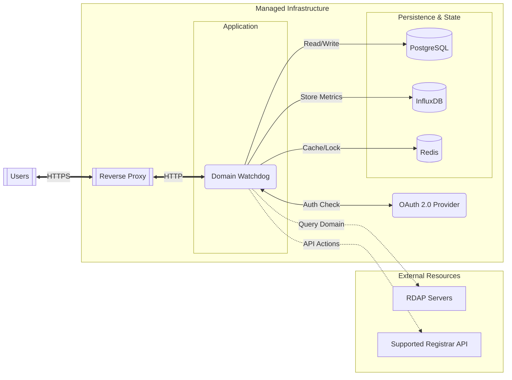

This page lists the main technologies used in the project, with links to their documentation. Specific version
information can be found in the project’s dependency files (`composer.lock`, `package.json`, etc.). The architecture
diagram below summarizes how these services interact.

```mermaid
flowchart LR
    USER[[Users]]

    subgraph EXT[External Resources]
        direction TB
        RDAP[RDAP Servers]
        PROVIDER[Supported Registrar API]
    end

    subgraph INFRA[Managed Infrastructure]
        RP[[Reverse Proxy]]

        subgraph APP_ZONE[Application]
            DW(Domain Watchdog)
        end

        subgraph DATA[Persistence & State]
            PG[(PostgreSQL)]
            INFL[(InfluxDB)]
            REDIS[(Redis)]
        end

        OAUTH(OAuth 2.0 Provider)
    end

    USER <==> |HTTPS| RP
    RP <==> |HTTP| DW

    DW --> |Read/Write| PG
    DW --> |Store Metrics| INFL
    DW --> |Cache/Lock| REDIS
    DW <--> |Auth Check| OAUTH

    DW -.-> |Query Domain| RDAP
    DW -.-> |API Actions| PROVIDER
```

## Backend

### Framework

The backend is written in [**PHP**](https://www.php.net/docs.php).

The backend is developed using the [**Symfony** framework](https://symfony.com/doc).

The API is made possible by the [**API Platform** project](https://api-platform.com/docs/symfony/).

### SQL Database

This project requires a [**PostgreSQL** database](https://www.postgresql.org/docs/current/).

Other database types cannot be used because some migrations were specifically written to leverage PostgreSQL-specific features and performance optimizations.

### Key-value Database

A [**Redis-compatible**](https://redis.io/docs/latest/apis/) key-value database is required to:

- Cache certain values
- Implement locks to limit the possibility of conditional raises
- Store messages for workers to process asynchronous actions
(e.g. updating domain names in a Watchlist on a high-priority RDAP client queue)

### Time-Series Database

The [**InfluxDB**](https://docs.influxdata.com/) database is optional.
A data point is added for the following events:

- RDAP requests from your instance: response time, requested domain name, HTTP status code, IP address of the RDAP server, etc.
- User notifications: adding events to a domain name, changing EPP statuses, etc.

### SSO authentication

An **OAuth 2.0** server is optional for user authentication.

Using Single Sign-On (SSO) allows you to delegate user authentication to a third party. This can be useful if you only
want people within your organization to be able to use this project instance. Furthermore, you can then configure
advanced security policies such as passwordless login, passkeys, multifactor authentication, and more.

### Error Reporting

The [**Sentry**](https://docs.sentry.io/platforms/php/guides/symfony/) integration is optional.
When enabled, Sentry captures and reports application errors, providing useful insights for debugging.
You can configure this feature through your project’s environment variables.

___

## Frontend

### Framework

The language for frontend development is [**TypeScript**](https://www.typescriptlang.org/docs/).

The framework used for the frontend is [**React**](https://react.dev/reference/react).

### Component Library

The component library used is [**Ant Design**](https://ant.design/components/overview/).
