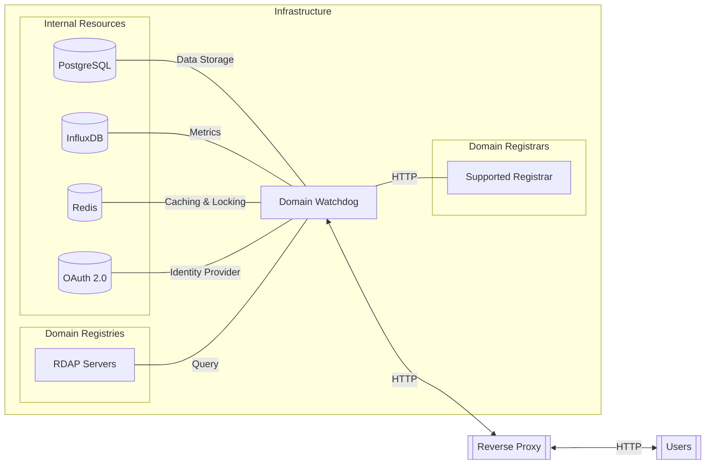

This page lists the main technologies used in the project, with links to their documentation. Specific version
information can be found in the project’s dependency files (`composer.lock`, `package.json`, etc.). The architecture
diagram below summarizes how these services interact.

## Backend

### Framework

The programming language is **PHP**.

The backend is developed using the **Symfony** framework ([documentation](https://symfony.com/doc)).

The API is made possible by the **API Platform**
project ([documentation](https://api-platform.com/docs/symfony/)).

### SQL database

This project requires a **PostgreSQL** database ([documentation](https://www.postgresql.org/docs/current/)).

Other database types cannot be used because some migrations were specifically written to leverage the performance of
this database management system.

### Key-value database

A **Redis-compatible** key-value database is required to:

- Cache certain values
- Implement locks to limit the possibility of conditional raises
- Store messages to be distributed to workers to process asynchronous actions. For example: updating domain names in a
  Watchlist on a high-priority RDAP client queue.

## Time Series database

The **InfluxDB** database is optional.
A data point is added for the following events:

- RDAP requests from your instance: response time, requested domain name, HTTP status code, IP address of the RDAP
  server, etc.
- User notifications: adding events to a domain name, changing EPP statuses, etc.

### SSO authentication

An **OAuth 2.0** server is not required to authenticate users.

Using Single Sign-On (SSO) allows you to delegate user authentication to a third party. This can be useful if you only
want people within your organization to be able to use this project instance. Furthermore, you can then configure
advanced security policies such as passwordless login, passkeys, multifactor authentication, and more.
___

## Frontend

### Framework

The language for frontend development is **TypeScript**.

The framework used for the frontend is **React** ([documentation](https://react.dev/reference/react)).

### Component Library

The component library used is **Ant Design** ([documentation](https://ant.design/components/overview/)).
