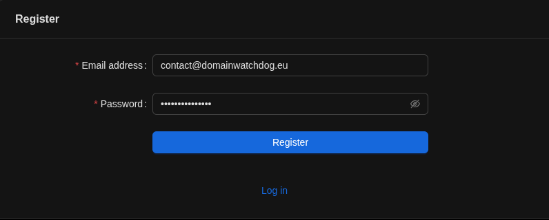
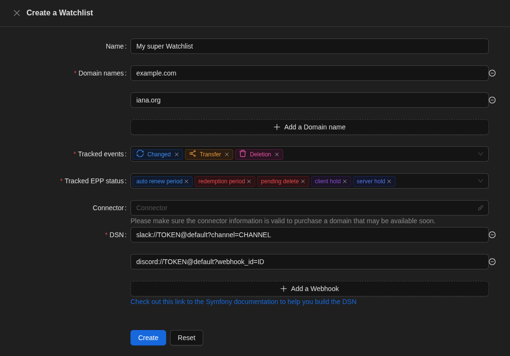
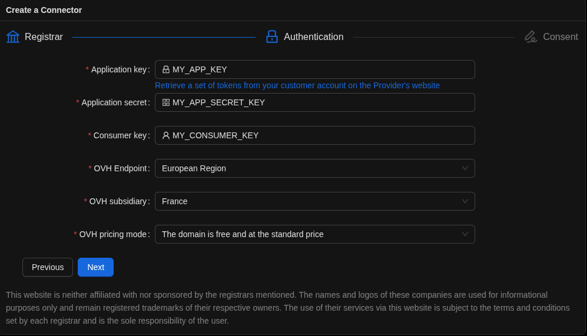

import {LinkCard, Steps} from '@astrojs/starlight/components';

On this page, you'll find a step-by-step guide to getting started with **Domain Watchdog** and exploring its main
features. The sidebar menu on the left allows you to quickly navigate between all documentation sections.

:::note
Depending on the configuration of the instance on which you're performing these actions, some options may be limited or
hidden.
:::

---

## Create an account

If your instance allows user registration, you can create an account directly from the interface.

<Steps>
1. Click the **Register** button.
2. Enter your **email address** and **password**.
3. A confirmation email will be sent to verify your address.
</Steps>

After confirming your email, you can log in and start using all available features.

---

## Search for a domain name

Domain Watchdog uses the **RDAP protocol**, the modern replacement for WHOIS, to retrieve accurate information about
domain names.

:::tip[Read more]
To read the documentation related to domain name search, please click on the link below.

<LinkCard title="Domain search"
          description="Obtain the details of a domain name registration and the history of observed events"
          href="/en/features/search/domain-search/"/>
:::

---

## Create a Watchlist

A **Watchlist** is a collection of domain names, triggers, and optionally an API Connector.
It allows you to:
- monitor domain status changes
- receive notifications (email or webhook: Slack, Mattermost, Discord, etc.)
- optionally auto-purchase a domain when it expires

:::tip[Read more]
To read the documentation related to the Watchlist, please click on the link below.

<LinkCard title="Watchlist"
          description="Add domain names to a Watchlist to track them, be notified of any changes, and potentially buy them when they expire"
          href="/en/features/tracking/watchlist/"/>
:::

### Watchlist notifications

When a domain changes state, you’ll automatically receive a notification.  
You can also export domain events as **iCalendar** feeds.

---

## Create a Connector

A **Connector** is used to automatically order (backorder) a domain name using its provider’s API.

:::tip[Read more]
To read the documentation related to Connector, please click on the link below.

<LinkCard title="Connector"
          description="Create a Connector to enable domain name purchases by linking it to your Watchlists"
          href="/en/features/backorder/connector/"/>
:::

### Supported registrar list

<LinkCard title="Supported registrar list"
          description="List of registrars supported by this project"
          href="/en/features/backorder/supported-registrar/"/>

---

### Tracking table

The Tracking table page displays a list of all the domain names you monitor via your Watchlists.
This list is ordered, meaning the domain names are arranged according to their estimated deletion date.

:::tip[Read more]
To read the documentation related to the Tracking table, please click on the link below.

<LinkCard title="Tracking table"
          description="List all the domains you're monitoring in your Watchlist and track the status of those domains"
          href="/en/features/tracking/tracking-table/"/>
:::
