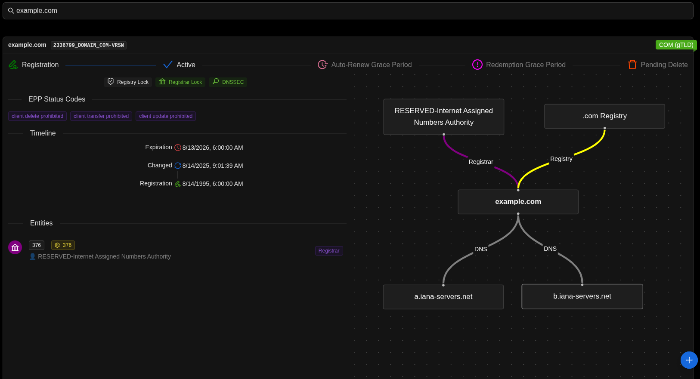

import {Steps} from "@astrojs/starlight/components"
import {Kbd} from "starlight-kbd/components"

:::tip[Did you know?]
In this project, everything is done to minimize the number of requests to RDAP servers. Limitations imposed on end users help control the flow of RDAP requests.
These limitations can be configured for each instance, in the environment variables.
:::

The domain search feature allows users to look up information about a domain name through the user interface.

To search for a domain name:

<Steps>
    1. Enter the domain in the search bar.
    2. Press <Kbd mac="Enter" generic="Enter" /> to submit the query.
</Steps>

If the extension you are searching for does **not** have an official RDAP server, an error message will inform you that no RDAP server is available.

## Force Update

By default, if the domain information stored in the database is still considered valid, the system returns the existing record without performing a new RDAP query.

If you need to force an RDAP update for a given domain:
* Press <Kbd mac="Shift+Enter" generic="Shift+Enter" /> when submitting the search.

This triggers a fresh lookup against the RDAP server.
